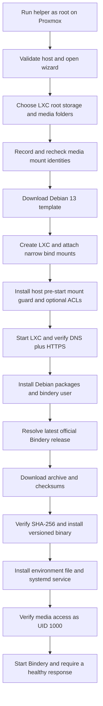

# Bindery Proxmox Helper

This repository installs [Bindery](https://github.com/vavallee/bindery) as a native application inside a Debian 13 Proxmox VE LXC.

It does not install Docker and it does not build Bindery from source. It downloads the latest official Linux release archive, verifies the published SHA-256 checksum, installs the binary behind a versioned symlink, creates a dedicated systemd service, and waits for the running application to pass its health check.

This project is independent of Bindery and the Proxmox VE Community Scripts project.

## Quick install

Run this on the **Proxmox VE host as root**:

```bash
bash -c "$(curl -fsSL https://raw.githubusercontent.com/AlexanderWilhelmsenBerg/bindery-proxmox-helper/main/bindery-lxc.sh)"
```

The same command later opens the management menu for installed Bindery containers.

Do not run the helper inside an LXC or ordinary Debian VM. It expects the Proxmox host commands `pct`, `pvesh`, `pvesm`, and `pveam`.

## Before you start

You need:

- A Proxmox VE host whose appliance index offers a Debian 13 standard LXC template.
- Root access to that host.
- Active Proxmox storage that supports `rootdir` content for the LXC root disk.
- Storage that supports `vztmpl` content for the Debian template.
- Downloads and library filesystems already mounted on the Proxmox host.
- Working DNS and HTTPS access from the new container.
- A disposable/non-production node for the first real-host acceptance run.

The helper never partitions, formats, or mounts a disk. It only offers filesystems that are already mounted.

## What will be created

The default setup creates:

| Item | Default |
|---|---|
| Container | Debian 13 LXC |
| CPU | 1 core |
| Memory | 1024 MB |
| Swap | 512 MB |
| Root disk | 8 GB on the Proxmox storage you select |
| Networking | DHCP for IPv4; you explicitly choose the IPv6 mode |
| Security | Unprivileged LXC |
| Nesting | Enabled for Debian 13 systemd service isolation |
| Start at boot | Enabled |
| SSH | Not installed |
| Bindery port | 8787 |
| Bindery process | Dedicated `bindery` user, UID/GID `1000:1000` |
| Telemetry | Disabled before first start unless you opt in |

Advanced mode lets you change the CT ID, hostname, resources, bridge, VLAN, IPv4, DNS, boot behavior, privilege mode, SSH, and Proxmox tags.

## Installation flow



The following sections walk through those stages in the same order as the code.

### 1. Host preflight

The `preflight` function refuses to continue unless:

- the script is running as root;
- the Proxmox command-line tools are present; and
- the host can provide the helper dependencies.

It installs missing host-side tools such as `whiptail`, `curl`, `jq`, `findmnt`, and `realpath` through APT. These are used for the wizard, release metadata, mount inspection, and path validation.

### 2. Container choices

`install_new` starts either the Default or Advanced wizard. Both modes then ask for:

1. IPv6 behavior: SLAAC, DHCPv6, or no automatic IPv6 address.
2. Proxmox `rootdir` storage for the LXC root disk.
3. A mounted host filesystem and folder for Downloads.
4. A mounted host filesystem and folder for the Bindery library.
5. Media permission handling.
6. Bindery telemetry consent.
7. Final confirmation.

The “Audiobook Library” folder is Bindery’s destination for both ebook and audiobook imports. The generated environment deliberately sets both `BINDERY_LIBRARY_DIR` and `BINDERY_AUDIOBOOK_DIR` to that folder. Upstream Bindery supports this shared-folder layout.

The selected Downloads folder is also used for `BINDERY_AUDIOBOOK_DOWNLOAD_DIR`. Individual download clients can use their own path remaps later in Bindery.

### 3. Media path safety

The folder browser does more than check whether a directory exists.

It:

- canonicalizes every selected path;
- rejects symlinks at the final selection;
- rejects commas and control characters that could corrupt a Proxmox mount property;
- blocks `/`, Proxmox state, system directories, temporary trees, and other broad host paths;
- records the selected mount ID, target, source, filesystem type, and UUID where available;
- requires each selected leaf folder to remain on the filesystem chosen in the wizard; and
- repeats the mount-identity check immediately before the LXC mounts are attached.

If a disk, NFS share, or other mount disappears while the wizard is running, the helper leaves the newly created LXC stopped and does not attach the underlying host directory by mistake.

### 4. Root disk versus media storage

These are separate storage concerns:

| Purpose | Host source | Container path |
|---|---|---|
| LXC operating system | Selected Proxmox `rootdir` storage | `/` |
| Downloads, combined layout | Selected common media parent | A subpath of `/data` |
| Library, combined layout | The same common media parent | A subpath of `/data` |
| Downloads, split layout | Exact Downloads folder | `/data/downloads` |
| Library, split layout | Exact library folder | `/data/audiobooks` |

When both folders safely share one selected filesystem, the helper exposes one common parent as `/data`. Bindery can then hardlink an import when the download and destination are on the same device.

When that topology is not safe, the helper attaches two exact paths. Imports still work, but Bindery may copy instead of hardlinking.

All media mount entries use `backup=0`, so Proxmox container backups do not try to include the external media collection.

### 5. Debian template and LXC creation

`get_debian13_template`:

1. finds active Proxmox storage that accepts `vztmpl`;
2. refreshes the `pveam` index;
3. maps an x86-64 host to `amd64` or an ARM64 host to `arm64`;
4. selects the newest Debian 13 standard template whose filename has that exact architecture; and
5. downloads it only when it is not already present.

`pct create` is left to inspect the template binary itself. Immediately after creation, the helper compares Proxmox's detected container architecture with the architecture selected above and stops before attaching media, changing permissions, or starting the LXC if they differ.

`create_lxc` builds a quoted argument array and calls `pct create`. User-selected values are passed as arguments, not evaluated as shell code. It enables only Proxmox's `nesting=1` feature so Debian 13 systemd can apply the Bindery service's mount-namespace isolation. Proxmox documents that nesting exposes some host `/proc` and `/sys` information to the guest, which is why the helper defaults to an unprivileged LXC and gives an additional warning before allowing the privileged-plus-nesting combination.

The helper then:

- attaches the media paths with explicit `volume=` mount syntax;
- writes the container description;
- installs a host-side LXC pre-start hook; and
- optionally applies host ACLs.

### 6. Persistent media guard

The one-time wizard check is not enough for a container configured to start after a host reboot. A network or removable filesystem might be unavailable while its empty mountpoint directory still exists.

For that reason, `install_media_mount_guard` creates:

```text
/usr/local/libexec/bindery-lxc/media-mount-guard-<CTID>.sh
```

and registers it as `lxc.hook.pre-start` in:

```text
/etc/pve/lxc/<CTID>.conf
```

Before every LXC start, the hook verifies the recorded filesystem identity for the common base and both selected leaf folders. Startup is refused if a mount is absent, replaced, or shadowed by a later nested mount.

This makes the LXC node-local. Before migrating it to another Proxmox node, recreate equivalent host mounts and deliberately update/recreate the guard.

### 7. Media permissions

Bindery runs as UID/GID `1000:1000` inside the LXC.

For a standard unprivileged LXC, UID 1000 maps to host UID 101000. For ordinary local Linux storage, choose **Grant access to the selected folders and newly created files** (recommended). The helper adds a named ACL for Bindery without changing ownership. This mode does not modify pre-existing subdirectories, so files later placed inside one of those old subdirectories must already be accessible.

Choose **Also grant access to every existing file and subfolder** when importing an existing library; this writes persistent ACL entries throughout the selected trees. Choose **Do not change permissions** for NFS, CIFS/SMB, NTFS, exFAT, or any setup where access is managed by the storage server or was configured separately.

Recursive ACL handling refuses known child mounts and filters every entry by device ID. It does not walk into another filesystem.

The helper never uses `chmod 777` and never changes ownership of the media tree.

### 8. Container startup and networking

After starting the LXC, the helper requires both:

1. DNS resolution for `github.com`; and
2. a successful TLS/HTTPS request to the GitHub API.

It first installs `ca-certificates` and `curl` inside the container. A ping alone is never treated as sufficient because the remaining install requires DNS and TLS.

If Advanced mode enables SSH, the root password is sent to `chpasswd` over `pct exec` standard input. It is not placed on the `pct create` command line or exposed through the host process list. OpenSSH is installed only after the password has been set successfully.

### 9. Files generated for the container

`make_inner_files` creates a temporary payload on the Proxmox host:

| Generated file | Installed location | Purpose |
|---|---|---|
| `bindery-update` | `/usr/local/sbin/bindery-update` | Install/update release manager |
| `bindery-backup` | `/usr/local/sbin/bindery-backup` | Consistent manual backup |
| `bindery.service` | `/etc/systemd/system/bindery.service` | Non-root systemd service |
| `bindery.env` | `/etc/bindery/bindery.env` | Bootstrap paths, port, UID/GID, telemetry |
| `install-inner.sh` | Temporary `/tmp/install-bindery.sh` | First-install orchestration |
| MOTD helper | `/etc/profile.d/90-bindery.sh` | Version, URL, and command reminder |

The payload is copied with `pct push`. Media paths are passed to the inner installer as ordinary arguments.

### 10. Debian packages and service account

Inside the LXC, `install-inner.sh`:

1. updates and upgrades Debian;
2. installs CA certificates, curl, jq, tar, gzip, SQLite, and operational tools;
3. creates the `bindery` group and user at UID/GID 1000;
4. creates `/opt/bindery`, `/var/lib/bindery`, `/var/backups/bindery`, and `/etc/bindery`;
5. secures the data directory for the service user;
6. installs the generated scripts, environment, and unit; and
7. calls `bindery-update --install`.

### 11. Official Bindery release installation

The generated updater:

1. queries `https://api.github.com/repos/vavallee/bindery/releases/latest`;
2. validates the returned release tag;
3. maps the LXC architecture to `amd64`, `arm64`, `armv7`, or `armv6`;
4. selects the exact archive `bindery_<version>_linux_<arch>.tar.gz`;
5. selects `bindery_<version>_checksums.txt`;
6. downloads both official release assets;
7. compares the archive’s SHA-256 with the published checksum;
8. extracts the complete release, including upstream license files;
9. locates and marks the `bindery` binary executable;
10. moves the staged release to `/opt/bindery/releases/<tag>`; and
11. points `/opt/bindery/current` at that version.

The Bindery binary is built upstream with `CGO_ENABLED=0` and embeds its web UI. No Node.js frontend, external database, or language runtime is required in the LXC.

### 12. Bindery environment

The generated `/etc/bindery/bindery.env` sets:

- `BINDERY_PORT=8787`;
- the SQLite database and application data under `/var/lib/bindery`;
- download and library paths from the selected media mounts;
- `BINDERY_PUID=1000` and `BINDERY_PGID=1000` as upstream sanity checks;
- the optional global download-path remap; and
- `BINDERY_TELEMETRY_DISABLED=true` unless telemetry was explicitly allowed.

The file uses systemd EnvironmentFile escaping. It is never sourced as a Bash script.

### 13. systemd service and first health check

The service runs:

```text
/opt/bindery/current/bindery
```

as the dedicated `bindery` user with `/var/lib/bindery` as its working directory.

Before the first start, the inner installer uses `runuser` to prove that UID 1000 can:

- read and traverse Downloads; and
- read, write, and traverse the library folder.

It then starts the service and requires:

- `systemctl is-active bindery`; and
- Bindery’s own `healthcheck` command to receive HTTP 200 from the local API.

If either check fails, the service is stopped, recent journal entries are printed, and the helper reports failure instead of claiming a successful install.

### 14. Completion marker and management

After a healthy first start, the host writes `/etc/bindery-helper.conf` inside the LXC. This records the port, media layout, selected container paths, IPv6 mode, mount guard, and telemetry choice.

Running the one-line helper again can:

- update Bindery;
- create a manual backup;
- restart the service;
- show version, IP, mounts, and service status;
- show recent logs; or
- open an LXC shell.

## Updating and rollback

Inside the LXC, run:

```bash
update
```

The update and backup commands share a non-blocking `flock`, so they cannot stop or mutate Bindery concurrently.

An update:

1. downloads and verifies the newest official release into a staged directory;
2. records whether the service was active and enabled;
3. stops Bindery;
4. creates a private, validated pre-update archive;
5. switches the `current` symlink;
6. starts the new release; and
7. probes the configured port and normalized URL base.

The URL-base probe accepts every form supported upstream: `/bindery`, `bindery`, or a full URL such as `https://books.example/bindery`.

If the new release is unhealthy, rollback:

1. validates the backup archive;
2. extracts into a sibling staging directory;
3. runs SQLite `PRAGMA quick_check` on the staged database;
4. installs a persistent fail-closed systemd condition before changing live data;
5. preserves the migrated data tree;
6. atomically activates the staged old data and old release;
7. tests that pair under a separate temporary systemd unit; and
8. only then re-enables the ordinary Bindery service.

If recovery cannot be proved safe, Bindery remains disabled and runtime-masked across reboot. Recovery details are stored under:

```text
/var/lib/bindery-maintenance/rollback-failed
```

This is deliberate: stopped service plus preserved data is safer than starting incompatible code against a partially restored database.

## Manual backups

Inside the LXC:

```bash
bindery-backup
```

The command stops Bindery only when it was running, writes a private temporary archive, validates it, atomically publishes it under `/var/backups/bindery`, and restores the previous service state.

The archive contains:

- `/var/lib/bindery`;
- `/etc/bindery`;
- the systemd unit; and
- the installed version marker.

It does not contain the external Downloads or library trees.

## Privacy and telemetry

[Upstream Bindery telemetry](https://github.com/vavallee/bindery/blob/main/PRIVACY.md) contacts `https://api.getbindery.dev/api/ping` on startup and then approximately daily when enabled.

The wizard discloses this before installing Bindery. “Disable before first start” is the default and writes `BINDERY_TELEMETRY_DISABLED=true` before the service ever starts.

The telemetry choice does not prevent required installation/update traffic to Debian mirrors and GitHub. The helper itself does not collect telemetry.

## Download-client paths

`BINDERY_DOWNLOAD_DIR` is not a general watch folder. Bindery normally gets each completed job’s path from the download-client API.

When qBittorrent, SABnzbd, or another client reports a path different from the one visible inside this LXC, configure a per-client path remap in Bindery. The wizard can optionally seed a single global `from:to` fallback.

For hardlinks, the download client and Bindery should see the same storage under compatible paths, and Downloads plus the library must be under the single `/data` mount.

## What a failure leaves behind

The helper intentionally does not automatically delete a partially configured LXC.

| Failure point | Expected state |
|---|---|
| Media mount changes before attachment | LXC exists, has no media mounts, and is stopped |
| Permission verification fails | LXC remains for inspection; Bindery is not declared installed |
| DNS/HTTPS readiness fails | LXC is running for network troubleshooting |
| Release checksum fails | No unverified Bindery release is activated |
| First Bindery health check fails | Bindery is stopped and journal output is shown |
| Update fails before switching | Previous service state is restored |
| Update fails after switching | Binary and data rollback is attempted |
| Rollback cannot be verified | Service remains persistently fail-closed |

## Verification

CI performs three layers of verification.

### Static and generated-file checks

```bash
shellcheck --severity=error bindery-lxc.sh tests/smoke.sh tests/live-bindery.sh
bash -n bindery-lxc.sh
bash -n tests/smoke.sh
```

The smoke suite extracts every embedded script, parses it, verifies the systemd unit, exercises validation helpers, mocks mount identity changes, tests ACL device boundaries, checks update/backup locking and rollback ordering, and inspects the generated Proxmox command flow.

### Live upstream Bindery contract

```bash
bash tests/live-bindery.sh
```

This test runs on an Ubuntu GitHub Actions worker. It:

1. resolves the current official Bindery release;
2. downloads the Linux archive and checksum file;
3. verifies SHA-256;
4. extracts the actual binary;
5. starts it with the same paths, UID/GID checks, port, and telemetry opt-out used by the helper;
6. calls both the HTTP health endpoint and the built-in `healthcheck` command;
7. confirms the configured SQLite database was created; and
8. shuts the process down cleanly.

The latest audited release on 2026-08-18 was Bindery v1.31.0.

### Remaining real-host boundary

Generic CI cannot execute a real `pct create`, exercise Proxmox storage plugins, validate an actual unprivileged LXC ID map, or prove that the host pre-start hook runs on your particular node.

Before production use, perform one acceptance install on a disposable Proxmox host:

1. Test a combined `/data` media layout.
2. Test a split-mount layout.
3. Confirm the pre-start guard blocks the CT when a selected mount is temporarily unavailable.
4. Confirm UID 1000 can read Downloads and write the library.
5. Configure one real download client and import one item.
6. Verify hardlink behavior where the combined layout is expected to support it.
7. Run `update` and `bindery-backup` once.
8. Reboot the node and confirm the expected mounts are ready before the LXC starts.

## Troubleshooting commands

On the Proxmox host:

```bash
pct status <CTID>
pct config <CTID>
pct enter <CTID>
```

Inside the LXC:

```bash
systemctl status bindery
journalctl -u bindery -n 100 --no-pager
cat /opt/bindery/VERSION
cat /etc/bindery/bindery.env
/opt/bindery/current/bindery healthcheck
```

If the pre-start guard blocks the LXC, restore the exact selected host mount first. Do not remove the guard merely to make the container start; doing so can expose an underlying Proxmox directory to Bindery.

## Repository layout

| Path | Purpose |
|---|---|
| `bindery-lxc.sh` | Host wizard, LXC creation, generated installer/updater/backup, management menu |
| `tests/smoke.sh` | Offline syntax, behavior, safety, and generated-artifact checks |
| `tests/live-bindery.sh` | Live official-release download/start/health compatibility check |
| `.github/workflows/syntax.yml` | CI definition |
| `LICENSE` | License for this helper |

## License

The helper is MIT-licensed. Bindery has its own upstream license and ships its own third-party notices inside every release archive.
